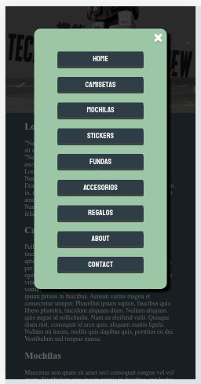
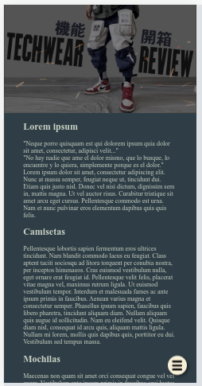

# Sticky Menu Fixed

Esta es una práctica simple de desarrollo de un menú para **mobile** 📱

* **Manipulation DOM**
* **addEventListener**
* **loop For**
* **classList.toogle**
* **setTimeOut()**

## [Live Demo](https://francomoreira.github.io/projects/sticky-menu-fixed/) 💻
---

